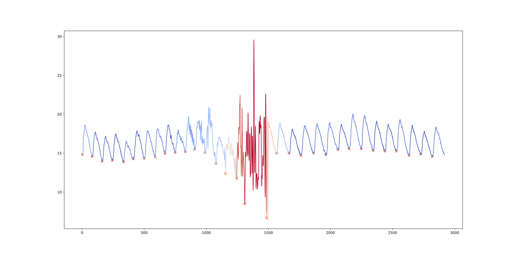

# REVERT Notebooks

Notebooks for unsupervised learning on ICP and cerebral flows waveforms. 



## Environment variables

The notebooks use `dotenv` to make jupyter aware of the environment variables used by the [revert](https://github.com/uartois-lml/revert) library. 

Edit your own copy of the following `.env` file example, and make sure the corresponding directories exist. 

```sh
# revert-notebooks/.env
INFUSION_DATASETS='~/revert-data/icp'
PCMRI_DATASETS='~/revert-data/pcmri'
REVERT_MODELS='~/revert-data/models'
REVERT_LOGS='~/revert-data/logs'
```

Defining the `INFUSION_DATASETS` and `PCMRI_DATASETS` variables saves typing full paths when using the raw dataset interfaces (to infusion `.hdf5` files from UCAM or PCMRI `.txt` files from CHU Amiens), and will be used by default to write the outputs of the data processing scripts. Defining `REVERT_MODELS` and `REVERT_LOGS` helps keeping a tidy workplace when using tensorboard or saving model states during training and testing of `revert.models.Module` instances.

See `help(revert.infusion.Dataset)` or `revert.models.Module`, ... for more details.